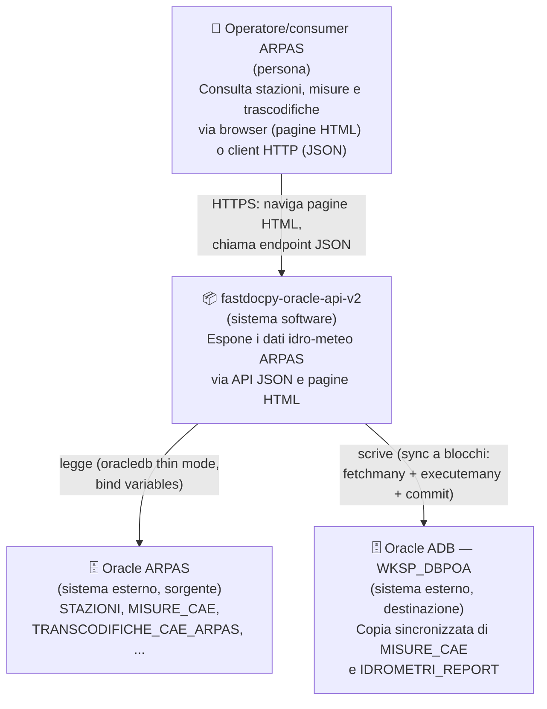
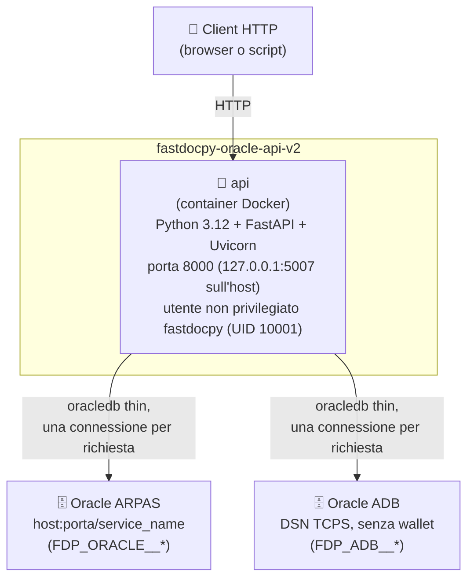
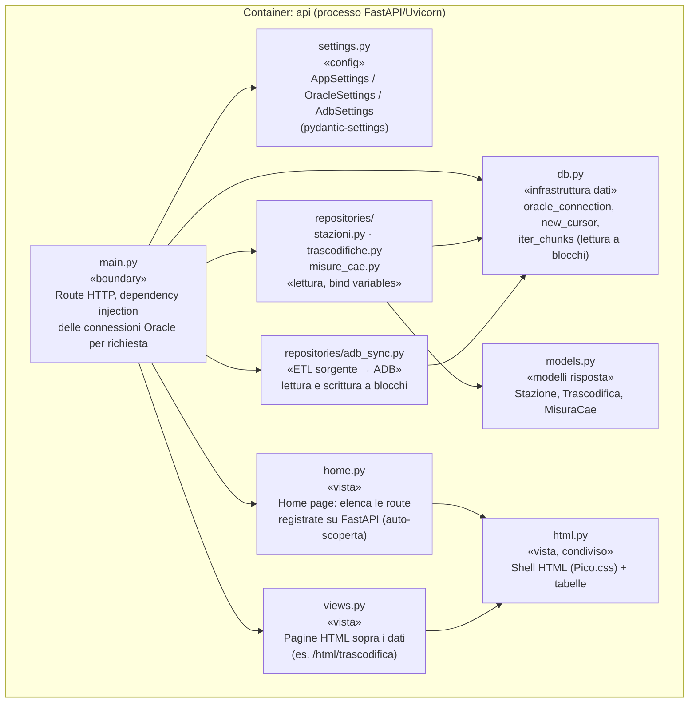
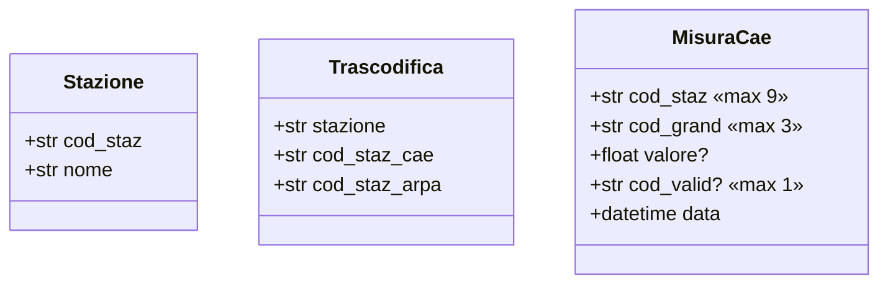
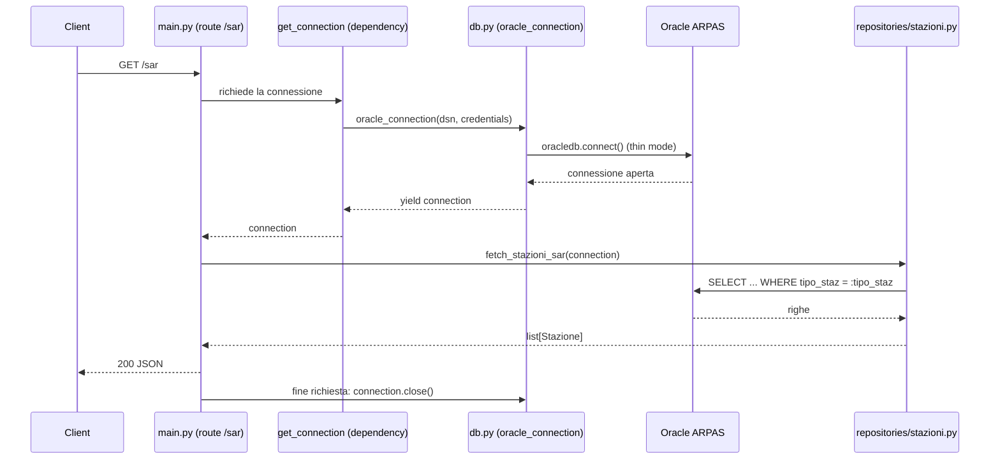
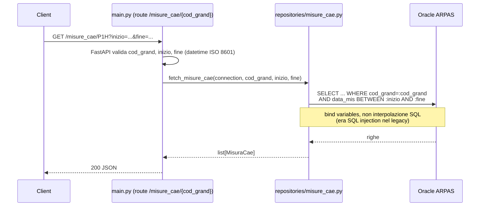
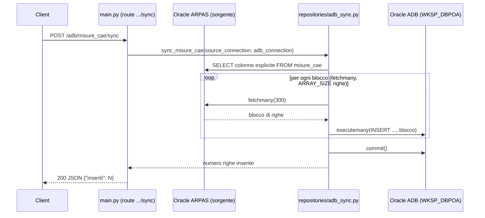
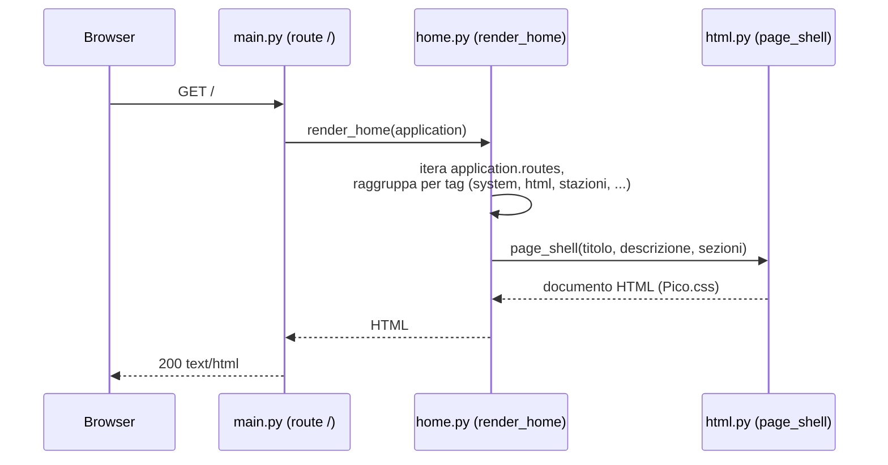

# Architettura — modello C4

Documentazione architetturale di **fastdocpy-oracle-api-v2** secondo il
[modello C4](https://c4model.com/): quattro livelli di dettaglio crescente
(Contesto, Container, Componenti, Codice — quest'ultimo omesso, il codice
stesso ne fa le veci), più le **viste dinamiche** per i flussi a runtime.
I diagrammi sono in Mermaid (renderizzati nativamente da GitHub); lo stile
richiama la notazione C4 (persona/sistema/container/componente) senza usare
la sintassi sperimentale `C4Context`/`C4Container` di Mermaid, per garantire
un rendering affidabile ovunque.

## Livello 1 — Contesto

Chi usa il sistema e con quali sistemi esterni comunica.

## Livello 2 — Container

Il sistema è oggi un solo container applicativo (nessun database proprio:
legge/scrive solo sui due Oracle esterni).

Configurazione (`app/settings.py`, `pydantic-settings`): valori non
sensibili da `.env`, credenziali da file singoli in `.secrets/` (dev) o
Docker secrets in `/run/secrets` (container) — mai in chiaro nelle env var.

## Livello 3 — Componenti

Struttura interna del container `api`.

## Modello dati (risposte Pydantic)

I vincoli di lunghezza di `MisuraCae` sono allineati al DDL reale di
`MISURE_CAE` (`docs/refactor-decisions.md`, sezione 5). Tutti i modelli
sono `frozen=True`: immutabili una volta costruiti.

## Flussi (viste dinamiche)

### Lettura semplice — `GET /sar`

### Lettura con parametri e bind variables — `GET /misure_cae/{cod_grand}`

### Sincronizzazione ADB a blocchi — `POST /adb/misure_cae/sync`

Nessun `cursor.fetchall()`: la tabella sorgente non viene mai
materializzata per intero in memoria (vedi `docs/refactor-decisions.md`,
sezione 6).

### Home page auto-generata — `GET /`

La home page non ha un elenco di route scritto a mano: viene ricostruita
leggendo `application.routes` ad ogni richiesta, quindi resta corretta da
sola quando si aggiungono o si tolgono endpoint (vedi `app/home.py`).

## Da tenere aggiornato

Questo documento va rivisto quando cambia la struttura, non ad ogni singola
route aggiunta:

- nuovo **container** (es. un secondo servizio, un database applicativo
  proprio) → aggiorna Livello 1 e 2
- nuovo **modulo** in `app/` con una responsabilità distinta → aggiorna
  Livello 3
- nuovo **flusso** con una forma diversa da quelli già documentati (es. una
  vera risposta in streaming, un webhook, un job schedulato) → aggiungi un
  diagramma di sequenza
